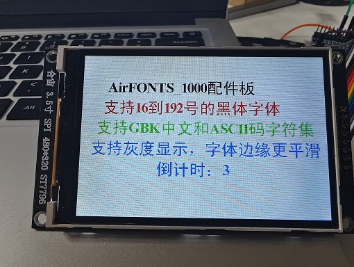
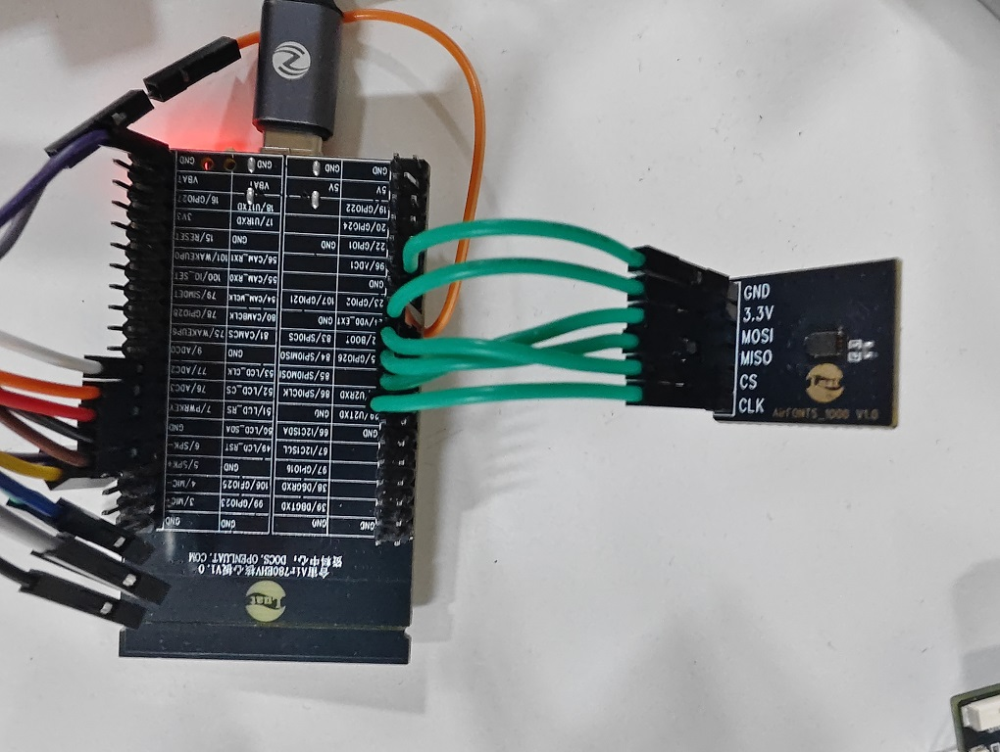

## 一、演示功能概述

AirFONT_1000 是合宙设计生产的一款 SPI 接口支持 16-192 矢量字体读取的配件板；

**本 demo 演示的核心功能为：**

Air780EHV 核心板 +AirFONT_1000 配件板，从 16-192 矢量字体各颜色字体的显示；
本demo Air780EHM/EHV/EGH通用

## 二、核心板 + 配件板资料

[Air780EHV 核心板 + 配件板相关资料](https://docs.openluat.com/air780ehv/product/shouce/)

## 三、演示硬件环境

### 1、接线图片

### **2、物料清单**

1、Air780EHV 核心板

2、AirFONT_1000 配件板

3、AirLCD_1001 屏幕

4、母对母的杜邦线 6 根，一定要使用配套的 5cm 长的杜邦线相连，杜邦线太长的话，会出现 spi 通信不稳定的现象；

5、Air780EHV 核心板和 AirFONT_1000 配件板的硬件接线方式为

- Air780EHV 核心板通过 TYPE-C USB 口供电（核心板正面的功耗测试开关拨到 ON 一端），此种供电方式下，VDD_EXT 引脚为 3.3V，可以直接给 AirFONT_1000 配件板供电；
- 为了演示方便，所以 Air780EHV 核心板上电后直接通过 vbat 引脚给 AirFONT_1000 配件板提供了 3.3V 的供电；
- 客户在设计实际项目时，一般来说，需要通过一个 GPIO 来控制 LDO 给配件板供电，这样可以灵活地控制配件板的供电，可以使项目的整体功耗降到最低；

### **3、接线方式**

**1、Air780EHV 核心板与 AirFONT_1000 配件板**
| Air780EVH核心板 | AirFONT_1000配件板 |
| --- | --- |
| VDD_EXT | 3V3 |
| GND | GND |
| SPI0_MOSI | MOSI |
| SPI0_MISO | MISO |
| SPI0_CS | CS |
| SPI0_SCLK | CLK |

**2、Air780EHV 核心板与 AirLCD_1001 屏幕**
| Air780EHV核心板 | AirLCD_1001屏幕 |
| --- | --- |
| VDD_EXT | 3V3 |
| GND | GND |
| 49/LCD_RST | RST |
| 50/LCD_SDA | SDA |
| 51/LCD_RS | RS |
| 52/LCD_CS | CS |
| 53/LCD_CLK | CLK |

## 四、演示软件环境

1、[Luatools 下载调试工具](https://docs.openluat.com/air780egh/luatos/common/download/?h=luatools)

2、[Air780EHV 最新版本的内核固件（注意固件版本号，以及不是 Air780EPM，）](https://docs.openluat.com/air780ehv/luatos/firmware/version/)

3、使用 demo 脚本

### **1、main.lua**

### **2、ui_main.lua**

### **3、AirFONTS_1000 .lua**

### 4、airlcd.lua

## 五、演示操作步骤

1、搭建好演示硬件环境

2、不需要修改 demo 脚本代码

3、Luatools 烧录内核固件和 demo 脚本代码

4、烧录成功后，自动开机运行

5、屏幕出现以下显示，就表示测试正常

